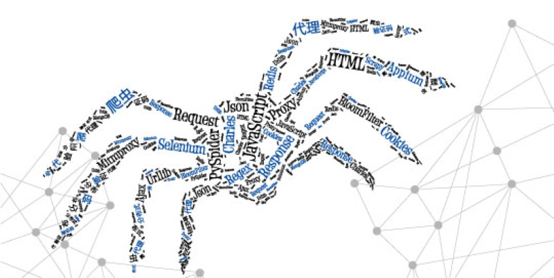

# Python爬虫学习



## Robots.txt
禁止爬取所有内容：
```text
User-Agent: *
Disallow: /
```

## 数据存储
爬取数据的存储应该在数据清洗和处理之前进行，确保信息的完整性。

## 爬虫书籍点评
- 《Python网络爬虫权威指南》（《Web Scraping with Python》）：关于爬虫的道德和法律有着重强调，对网页抓取有一个较为全面的概述，但是看起来不是很舒适，总感觉学到的真东西少。
- 《Python3爬虫、数据清洗与可视化实战》：课后题一看就是老国产书风格了，内容还是比较实用的，作者为了保护网站隐私对网页URL都打了码。
- 《Python3网络爬虫开发实战》：600页左右，讲的挺细的，还没细看，建议有时间看看。
- 《从零开始学Python网络爬虫》：实战风格强，手把手地教，泪目，图书馆里这本书两年不到都翻烂了，上手应该挺快的。
